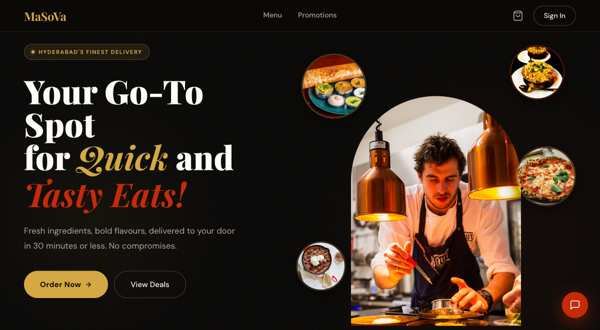
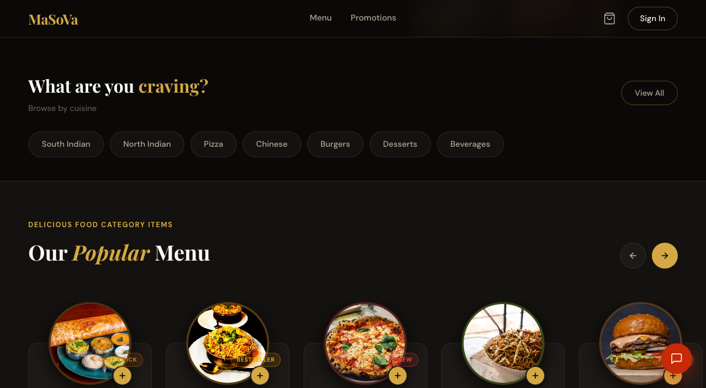

# MaSoVa Restaurant OS

<div align="center">

**The complete operating system for modern restaurants.**

*Customer ordering · Kitchen display · Delivery management · AI analytics · Multi-store*


**6 microservices · 8 AI agents · 6 web apps · 2 mobile apps**

</div>

---

## What is MaSoVa?

MaSoVa is a **production-grade, full-stack restaurant operating system** built for multi-store operations. It covers the entire restaurant lifecycle: customers browse menus, place orders, and track deliveries in real time. Kitchen staff manage live order queues on a dedicated display. Drivers receive assignments and confirm delivery via OTP on mobile. Managers get demand forecasting, staff scheduling, revenue analytics, and aggregator order normalisation — all from one unified platform.

**Built for EU restaurant owners who need more than a POS.** MaSoVa handles what aggregators (Wolt, Deliveroo, Just Eat, Uber Eats), legacy POS terminals, and manual spreadsheets cannot — unified, compliant, and scalable across Europe.

---

## For Restaurant Owners

| Problem today | How MaSoVa solves it |
|---|---|
| Orders from multiple aggregators on separate tablets | All channels land in one unified kitchen queue |
| Kitchen doesn't know which order is urgent | Live KDS with per-item timers and automatic status updates |
| Stockouts discovered too late | Inventory agent alerts and drafts reorder suggestions |
| Weekend prep is guesswork | Demand forecasting predicts item-level sales from your history |
| Customer feedback takes hours to respond to | Review response agent drafts personalised replies for manager approval |
| Staff scheduling is manual every week | Shift optimisation agent recommends staffing from forecasted footfall |
| Delivery fees inconsistent across channels | Zone-based pricing computed server-side, displayed in store currency |
| VAT compliance is manual | EU VAT calculated per country, order type, and item category — 12 countries |
| Fiscal signing differs by country | Automated fiscal signing for DE, FR, IT, BE, HU, GB at order completion |
| Multiple locations means double the chaos | Full multi-store support — each store has its own menu, staff, and analytics |

👉 **[Demo guide →](DEMO.md)**

---

## Architecture

```
                        ┌─────────────────────┐
                        │     API Gateway      │  :8080
                        │  JWT · Rate Limiting │
                        │  Spring Cloud Gateway│
                        └──────────┬──────────┘
                                   │
         ┌─────────────────────────┼──────────────────────────┐
         │                         │                          │
  ┌──────▼──────┐          ┌───────▼──────┐          ┌───────▼──────┐
  │    Core     │          │   Commerce   │          │   Payment    │
  │   Service   │          │   Service    │          │   Service    │
  │   :8085     │          │   :8084      │          │   :8089      │
  │ Auth · Users│          │ Orders · Menu│          │Stripe · EU VAT│
  │ Stores · PIN│          │ Cart · KDS   │          │ Fiscal · Tx   │
  └─────────────┘          └──────────────┘          └──────────────┘
         │                         │                          │
  ┌──────▼──────┐          ┌───────▼──────┐
  │  Logistics  │          │ Intelligence │
  │   Service   │          │   Service    │
  │   :8086     │          │   :8087      │
  │Delivery·OTP │          │ Analytics    │
  │ Aggregators │          │ AI Insights  │
  └─────────────┘          └──────────────┘
         │
  ┌──────▼──────────────────────────────────────────┐
  │                  Infrastructure                  │
  │  MongoDB · PostgreSQL · Redis · RabbitMQ         │
  │  Docker Compose · GCP Cloud Run                  │
  └──────────────────────────────────────────────────┘
```

Event-driven communication via RabbitMQ (`masova.orders.exchange`, `masova.notifications.exchange`). Business events never use direct service-to-service HTTP — only Feign clients for synchronous internal queries.

Full details: [docs/ARCHITECTURE.md](docs/ARCHITECTURE.md)

---

## Screenshots

<table>
  <tr>
    <td align="center"><br/><sub><b>Customer Home</b></sub></td>
    <td align="center"><br/><sub><b>Menu Browse</b></sub></td>
    <td align="center"><br/><sub><b>Ordering Flow</b></sub></td>
  </tr>
</table>

---

## Feature Surface

### Web Applications (React 19 · TypeScript · Vite)

| App | Audience | Key Features |
|---|---|---|
| **Customer App** | Customers | Menu browsing, cart, online ordering, live order tracking, AI chat |
| **POS / Kiosk** | In-store staff | Touch-first ordering, PIN auth, dine-in/takeaway, receipt printing |
| **Kitchen Display (KDS)** | Kitchen staff | Live order queue, per-item timers, quality checkpoints |
| **Driver App** | Delivery drivers | Active delivery view, OTP proof-of-delivery, delivery history |
| **Manager Dashboard** | Managers | Revenue analytics, staff management, inventory, AI insights, reports |
| **Public Website** | Everyone | Landing page, public menu, store locator, promotions |

### Mobile Applications

| App | Stack | Audience |
|---|---|---|
| **masova-mobile** | React Native 0.81 | Customers — ordering, tracking, payments, Google Maps |
| **MaSoVa Crew** | React Native 0.83 | Kitchen, Driver, Cashier, Manager — role-based via JWT |

---

## Tech Stack

| Layer | Technology |
|---|---|
| **Backend** | Java 21, Spring Boot 3.5.16, Spring Security 6, Spring Cloud Gateway 2025.0.3 |
| **ORM / Data** | Spring Data MongoDB, Spring Data JPA (Hibernate 6), Flyway |
| **Database** | MongoDB 7 (primary), PostgreSQL (financial/relational), Redis 7 (sessions, blacklist) |
| **Messaging** | RabbitMQ 3.12 — event-driven order and notification flows |
| **Frontend** | React 19, TypeScript, Vite, MUI, RTK Query, Redux Toolkit |
| **Design System** | Neumorphic UI (staff), Dark-Premium (customer web), Glassmorphism (customer mobile) |
| **Payments** | Stripe (SCA/3D Secure, EU/international), Razorpay (India legacy) — routed by store `countryCode` |
| **Auth** | JWT (HS512), Redis blacklist for logout, PIN auth for POS |
| **Testing** | JUnit 5, Mockito, Vitest, React Testing Library, Pact, Playwright |
| **Deployment** | GCP Cloud Run, Firebase Hosting, Docker Compose |

---

## System Design Highlights

- **Dual-write persistence** — PostgreSQL first (synchronous), MongoDB second (async) for financial data
- **11-state order lifecycle** — every transition publishes to `masova.orders.exchange`
- **Multi-gateway payment routing** — Stripe for EU/international stores, Razorpay for India legacy
- **207 canonical API endpoints** — documented in `docs/api-contracts/`
- **EU VAT engine** — 12-country, context-aware VAT (DINE_IN / TAKEAWAY / DELIVERY, FOOD / ALCOHOL / BEVERAGE)
- **Fiscal compliance** — DE, FR, IT, BE, HU, GB signing at order completion
- **Allergen compliance** — 14 EU allergens enforced; items cannot go live without manager declaration
- **Aggregator Hub** — Wolt, Deliveroo, Just Eat, Uber Eats normalised into one order queue
- **Multi-tenancy** — all data scoped to `storeId` with database-level isolation
- **GDPR** — built-in data erasure flow across all services

---

## Quick Start

**Prerequisites:** Java 21, Node 20+, Docker, Maven 3.9+

```bash
# 1. Infrastructure
docker compose up -d mongodb redis rabbitmq postgres

# 2. Backend (one terminal per service)
cd api-gateway      && mvn spring-boot:run "-Dmaven.test.skip=true"   # :8080
cd core-service     && mvn spring-boot:run "-Dmaven.test.skip=true"   # :8085
cd commerce-service && mvn spring-boot:run "-Dmaven.test.skip=true"  # :8084
cd payment-service  && mvn spring-boot:run "-Dmaven.test.skip=true"  # :8089
cd logistics-service && mvn spring-boot:run "-Dmaven.test.skip=true" # :8086
cd intelligence-service && mvn spring-boot:run "-Dmaven.test.skip=true" # :8087

# 3. Frontend
cd frontend && npm install && npm run dev   # :3000

# 4. Seed data (first time)
node scripts/seed-database.js
```

```bash
# Verify
curl http://localhost:8080/actuator/health
curl http://localhost:8085/actuator/health
```

Full setup: [docs/STARTUP-GUIDE.md](docs/STARTUP-GUIDE.md)

**Optional — sibling repos:**

| Repo | Command |
|---|---|
| AI agents (`masova-support`) | `uvicorn src.masova_agent.main:app --host 0.0.0.0 --port 8000 --reload` |
| Customer mobile (`masova-mobile`) | `npx react-native start --port 8888` |
| Staff mobile (`MaSoVaCrewApp`) | `npx react-native start` |

Configure mobile `API_BASE_URL` to point at your gateway (e.g. `http://localhost:8080/api`).

---

## Project Structure

```
masova/
├── api-gateway/           # Spring Cloud Gateway — routing, JWT, rate limiting
├── core-service/          # Auth, users, stores, sessions, PIN validation
├── commerce-service/      # Orders, menu, cart, inventory, KDS, aggregator hub
├── payment-service/       # Stripe + Razorpay, transactions, refunds, webhooks
├── logistics-service/     # Delivery assignments, driver tracking, OTP, zones
├── intelligence-service/  # Analytics, reports, AI-powered recommendations
├── shared-models/         # Shared enums, events, and domain DTOs
├── shared-security/       # JWT utilities, security config
├── frontend/              # React 19 — all 6 web applications
├── infrastructure/        # Docker Compose, GCP configs
├── scripts/               # DB seeding, dev utilities, deployment helpers
└── docs/                  # Architecture, API contracts, deployment guides
```

---

## Documentation

| Document | Description |
|---|---|
| [DEMO.md](DEMO.md) | Demo guide for restaurant clients |
| [DOCUMENTATION.md](DOCUMENTATION.md) | Full documentation index |
| [docs/ARCHITECTURE.md](docs/ARCHITECTURE.md) | Service map, flows, data model |
| [CONTRIBUTING.md](CONTRIBUTING.md) | Development setup, branching, commits |
| [docs/api-contracts/](docs/api-contracts/) | OpenAPI specs and contract validation |
| [CHANGELOG.md](CHANGELOG.md) | Release history |

---

## Platform Status

| Capability | Status |
|---|---|
| 6-service microservice architecture | ✅ Live |
| 207 canonical API endpoints | ✅ Live |
| Dual-write MongoDB + PostgreSQL | ✅ Live |
| Dark-premium customer web + neumorphic staff UI | ✅ Live |
| Stripe + Razorpay multi-gateway payments | ✅ Live |
| EU VAT + fiscal signing (12 countries) | ✅ Live |
| Aggregator hub (Wolt, Deliveroo, Just Eat, Uber Eats) | ✅ Live |
| AI agents (8 agents, propose-then-approve) | ✅ Live |
| Staff + customer mobile apps | ✅ Live |
| GCP Cloud Run deployment pipeline | ✅ Live |

---

## Contributing

See [CONTRIBUTING.md](CONTRIBUTING.md) for branching strategy, commit format, and PR checklist.

---

## License

MIT © 2025 MaSoVa